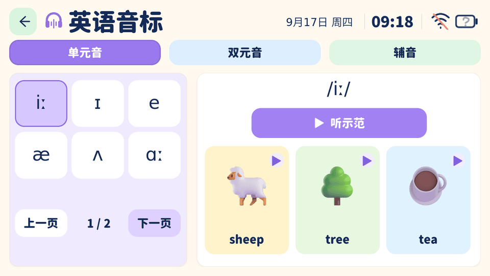
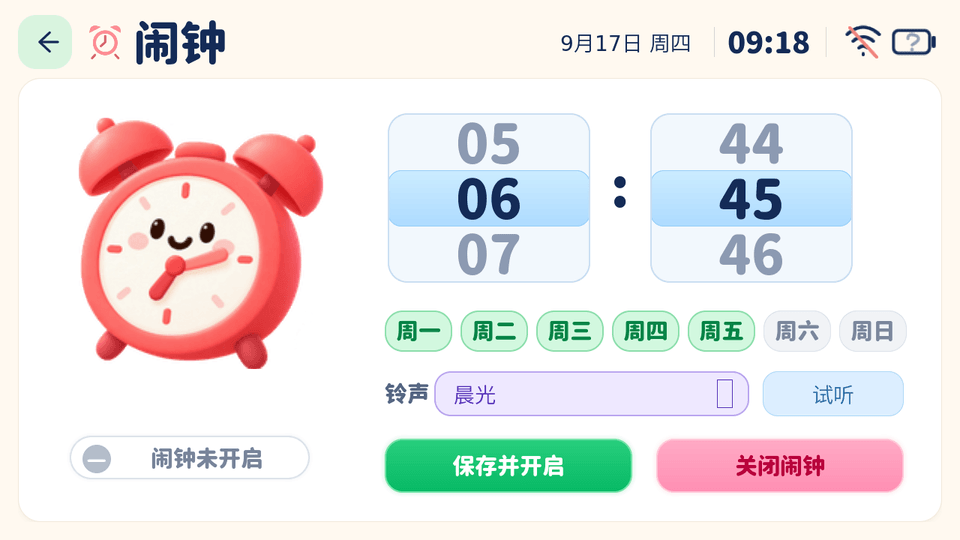
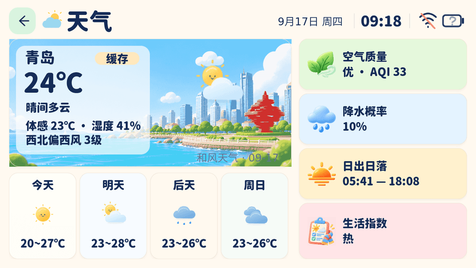
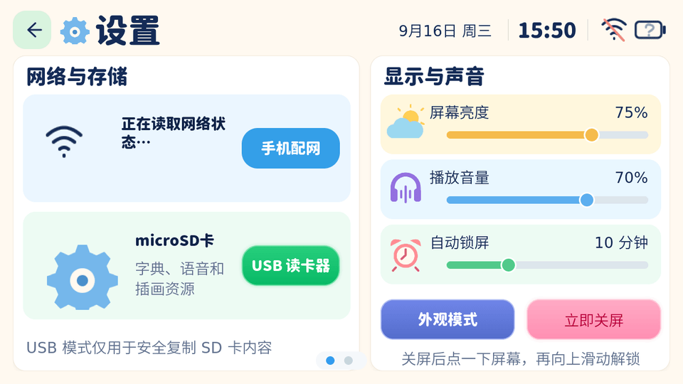
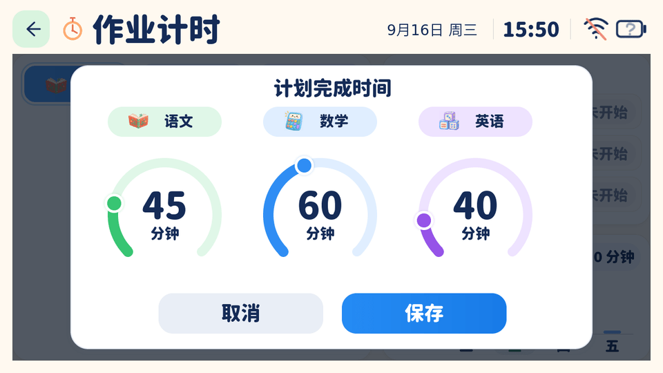
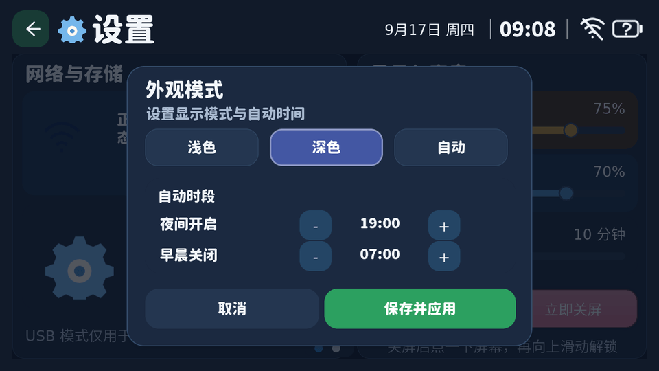

# ESP32 Han Dictionary · 小小助手

面向 **M5Stack Tab5（ESP32-P4，1280×720）** 的儿童学习终端固件。项目基于
[78/xiaozhi-esp32](https://github.com/78/xiaozhi-esp32)，在联网语音助手基础上加入查字、
英语音标、课程表、作业计时、闹钟、天气、翻页时钟、儿童对话、设置与 MQTT 留言板，
并为全部主要页面提供统一的浅色/深色主题。

> 当前产品变体是 `m5stack-tab5-han-dictionary`（ESP32-P4 Rev < 3）和
> `m5stack-tab5-han-dictionary-p4x`（Rev >= 3）。其他上游开发板不会启用这套学习 UI。

## 界面预览

以下图片由仓库中的真实 LVGL 页面代码渲染，不是概念设计稿；模拟器替代了网络、音频、
SD 卡和电池硬件，因此截图不能代替真机验收。

| 浅色主页 | 深色主页 |
| --- | --- |
|  |  |

| 小小字典 | 英语音标 |
| --- | --- |
|  |  |

| 课程表 | 作业计时 |
| --- | --- |
|  |  |

| 闹钟 | 天气 |
| --- | --- |
|  |  |

| 设置 | 翻页时钟 |
| --- | --- |
|  |  |

| 分科计划时间 | 深色模式设置 |
| --- | --- |
|  |  |

[查看全部 21 张浅色/深色实渲图](docs/ui/gallery) ·
[UI 文档](docs/ui/README.md) · [真机调试记录](docs/HARDWARE_BRINGUP.md)

## 已实现功能

- **主页与语音助手**：六个学习入口；联网小智语音；可滚动的对话历史；停止对话；
  页面内查字跳转；状态栏、电池详情和 Wi-Fi 状态。
- **小小字典**：拼音、部首、笔画、结构、释义、组词、笔顺播放；SD 字条与笔顺帧按需读取；
  拼音搜索与完整释义弹窗。
- **英语音标**：44 个教学音标、分页、示范音和例词点读；例词插画与音频放在 SD 卡。
- **课程表**：固定周一至周五、每天七节课，学科图标与统一卡片布局。
- **作业计时**：语文/数学/英语独立计时，分钟与秒钟显示，工作日历史，30–99 分钟环形计划设置；
  状态及计划写入 NVS。
- **闹钟**：单个闹钟、周一至周日重复、SD 铃声下拉选择、试听、停止本次响铃。
- **天气**：青岛城市插画、实时天气、四日预报、空气质量、降水、日出日落与生活指数；
  生活指数支持完整内容弹窗和离线缓存。
- **翻页时钟**：点击主页时间进入，显示时、分、秒、年月日、星期与农历，包含翻页动画。
- **设置**：配网、USB microSD 读卡器、亮度、音量、自动锁屏、立即关屏、手势解锁、
  手动/定时深色模式；横向滑动进入 MQTT 留言板页。
- **MQTT 留言板**：从 SD 卡 `mqtt.json` 读取 broker、端口、账号与订阅主题，显示最近留言；
  未配置时保持关闭，不在仓库中保存私人凭据。
- **深色主题**：主页、字典、音标、课程表、作业、闹钟、天气、时钟和设置均有深色适配。

## 硬件与版本

| 项目 | 要求 |
| --- | --- |
| 设备 | M5Stack Tab5，1280×720 横屏 |
| 芯片 | ESP32-P4 Rev 1.x/2.x 使用 Legacy 变体；Rev 3.x 使用 P4X 变体 |
| SDK | **ESP-IDF v6.0.2**（本仓库首选并已验证） |
| Flash | 16 MiB；产品使用 `partitions/han16m.csv`，两个 6 MiB OTA 应用槽 |
| 存储卡 | microSD；大插画、字典内容、音标/铃声音频和私有配置均从卡中读取 |
| 当前固件 | `xiaozhi.bin` 约 4.76 MiB；6 MiB 应用槽尚余约 1.24 MiB（提交时测量） |

Legacy Rev 1.3 真机已经验证显示、触摸、Wi-Fi、语音唤醒、页面切换、USB 读卡器和应用烧录。
P4X 目前以构建验证为主；不同屏幕批次、触摸四角、长时间续航和异常断网仍需分别实测。

## 构建

### 1. 准备 ESP-IDF

安装并激活 ESP-IDF v6.0.2：

```powershell
. D:\esp\v6.0.2\esp-idf\export.ps1
idf.py --version
```

Linux/macOS 使用对应安装目录中的 `export.sh`。首次克隆后不要提交或复制另一台电脑的
`build/`、`managed_components/`、`sdkconfig` 或 Python 虚拟环境。

### 2. 识别芯片修订版

Windows 可使用仓库脚本（把串口换成实际端口）：

```powershell
.\tools\detect-hardware.ps1 -Port COM18
```

不要把 P4X 固件刷入 Rev 1.x 芯片。

### 3. 编译产品变体

Canonical 构建命令：

```powershell
python scripts/build.py m5stack-tab5 --name m5stack-tab5-han-dictionary
```

Rev 3.x/P4X：

```powershell
python scripts/build.py m5stack-tab5 --name m5stack-tab5-han-dictionary-p4x
```

Windows 也可使用包装脚本：

```powershell
. .\tools\setup.ps1
.\tools\build.ps1 -HardwareRevision Legacy   # 或 P4X
```

### 4. 烧录

从普通小智固件首次迁移时必须完整烧录分区表、启动程序和应用：

```powershell
idf.py -p COM18 flash monitor
```

只有分区表完全一致时才适合单独更新应用。`build/` 始终代表最后一次构建的变体。

## 准备 microSD

仓库中的 `content/sdcard/handict/` 是可直接复制的示例内容树。也可以生成到一个不存在的
新目录并校验：

```powershell
python tools/content_pack.py prepare --output dist/sdcard-starter
python tools/content_pack.py validate dist/sdcard-starter/handict
```

把生成的 `handict` 目录放在 microSD 根目录。主要配置：

- `handict/qweather.json`：和风天气 API Host、Key 与地点；私有凭据不要提交。
- `handict/mqtt.json`：留言板 broker 配置；仓库示例默认 `enabled: false`。
- `handict/alarms/`：Ogg/Opus 闹钟铃声和 `catalog.json`。
- `handict/phonetics/`：音标示范、例词音频与卡片。
- `handict/ui/graphics/`：天气、设置、音标、MQTT 等大图资源。
- `handict/dictionary/`：示例字条、索引和笔顺帧。

设备设置页的“USB 读卡器”会暂时把 USB-C 交给 TinyUSB MSC，此时串口、字典内容访问和
语音资源暂停。电脑端完成操作后先安全弹出，再点“重启并恢复”或复位设备。

[SD 卡完整说明](docs/SD_CARD.md) · [和风天气配置](docs/QWEATHER.md) ·
[MQTT 留言板配置](content/sdcard/handict/MQTT_MESSAGE_BOARD.md)

## 测试与 UI 资源

```powershell
# 构建/配置/内容包主机测试
python -m unittest discover -s scripts/tests -v

# 图像、字体、音频清单和容量约束（首次需要 npm ci）
npm ci --prefix tools/ui-assets
node --test tools/ui-assets/*.test.cjs

# Windows LVGL 模拟器，需要 Visual Studio C++ Build Tools
.\tools\preview-ui.ps1
```

固件正常构建只使用已提交的生成文件，不要求 Node.js 或 Visual Studio。修改图片、字体或
README 截图时才需要 `tools/ui-assets/`。`tools/ui-assets/readme-gallery.cjs` 会把当前模拟器的
浅色/深色 PPM 渲染压缩为 `docs/ui/gallery/` 中的文档图片。

## 能力边界

- 本项目**不是完整的离线《新华字典》**。仓库只含项目编写的演示字条和少量笔顺数据，
  不包含受版权保护的纸书正文、页码数据库或扫描页。
- 中文任意字形、全量词条和全部笔顺尚未内置；未知内容需要合法数据源或联网服务。
- 天气依赖和风天气服务与用户自己的 API 凭据；无网络时只显示最近一次有效缓存。
- 语音对话依赖所配置的小智服务器；离线状态仍可使用本地页面、计时、闹钟和已有 SD 内容。
- 当前仅支持一个软件闹钟。关屏不会进入深度睡眠；尚未把下一次闹钟写入 RX8130 进行 RTC 唤醒。
- MQTT 留言板是轻量订阅客户端，不是 broker，也不替代 Mosquitto 的账号、ACL、TLS 与公网安全配置。
- USB MSC、SD 热拔插、长时间断网恢复、不同 Tab5 硬件修订版和整日续航仍需真机专项验证。
- 模拟器截图验证布局与交互结构，不验证扬声器、麦克风、触摸精度、电池或网络时序。

## 直接使用的开源项目与素材

| 项目 | 本项目中的用途 | 许可证/说明 |
| --- | --- | --- |
| [78/xiaozhi-esp32](https://github.com/78/xiaozhi-esp32) | 固件、音频、网络、协议与多开发板基础 | MIT；本仓库的上游 |
| [espressif/esp-idf](https://github.com/espressif/esp-idf) | ESP32-P4 SDK、FreeRTOS、网络、NVS、MQTT 等 | Apache-2.0 及组件各自许可证 |
| [lvgl/lvgl](https://github.com/lvgl/lvgl) | 全部触屏界面、控件与绘制 | MIT |
| [microsoft/fluentui-emoji](https://github.com/microsoft/fluentui-emoji) | 英语例词插画，经裁切和缩放后放入 SD 包 | MIT；固定 revision 见 provenance |
| [chanind/hanzi-writer-data](https://github.com/chanind/hanzi-writer-data) | “规”“矩”演示笔顺路径 | 来源于 Make Me A Hanzi/文鼎字体；ARPHIC PUBLIC LICENSE |
| [CyanoHao/Resource-Han-Rounded](https://github.com/CyanoHao/Resource-Han-Rounded) | 学习页面圆体中文字体子集 | SIL Open Font License 1.1 |
| [adobe-fonts/source-han-sans](https://github.com/adobe-fonts/source-han-sans) | 部分 UI 中文字体与预览文字 | SIL Open Font License 1.1 |
| [dejavu-fonts/dejavu-fonts](https://github.com/dejavu-fonts/dejavu-fonts) | 拉丁、符号和 IPA 字形 | DejaVu Fonts License |
| [suragch/aePronunciation](https://github.com/suragch/aePronunciation) | 音标独立示范音来源 | GPL-3.0；音频及完整许可随 SD 包分发 |
| [KDE/plasma-mobile-sounds](https://github.com/KDE/plasma-mobile-sounds) | 四个闹钟铃声的原始录音 | 所选录音为 CC0 1.0，明细见铃声 README |

例词语音由开发机上的 Microsoft Zira TTS 生成；和风天气是外部数据服务，不属于上述开源依赖。
完整素材来源、固定版本和许可证副本见 [assets/README.md](assets/README.md)、
[SD 素材声明](content/sdcard/handict/ASSET-NOTICES.md)、
[音标来源清单](content/sdcard/handict/phonetics/AUDIO_SOURCES.json) 与
[铃声来源](content/sdcard/handict/alarms/README.md)。通过 ESP-IDF Component Manager 引入的
其他底层组件以 `main/idf_component.yml` 和构建生成的 `dependencies.lock` 为准。

## 目录

- `main/han_dictionary/`：产品 UI、内容读取、计时、天气、MQTT 与页面逻辑。
- `main/boards/m5stack/tab5/`：Tab5 板级驱动、电源、USB、SD、音频和显示接入。
- `content/sdcard/handict/`：可复制到 microSD 的公开示例内容。
- `assets/`：可重复生成的源图、字体、笔顺与许可证；不是整包复制到 SD 的目录。
- `tools/ui-assets/`：图像/字体生成与资源测试。
- `tools/ui-simulator/`：直接编译产品页面代码的桌面 LVGL 模拟器。
- `docs/`：硬件调试、SD、天气、UI、协议与工程说明。

## 许可证

应用代码沿用仓库 [MIT License](LICENSE)。字体、笔顺、音频和第三方插画仍受各自许可证约束；
重新分发时请保留对应声明。AI 生成的原创插画按生成结果原样提供，不额外声称独占权利。
