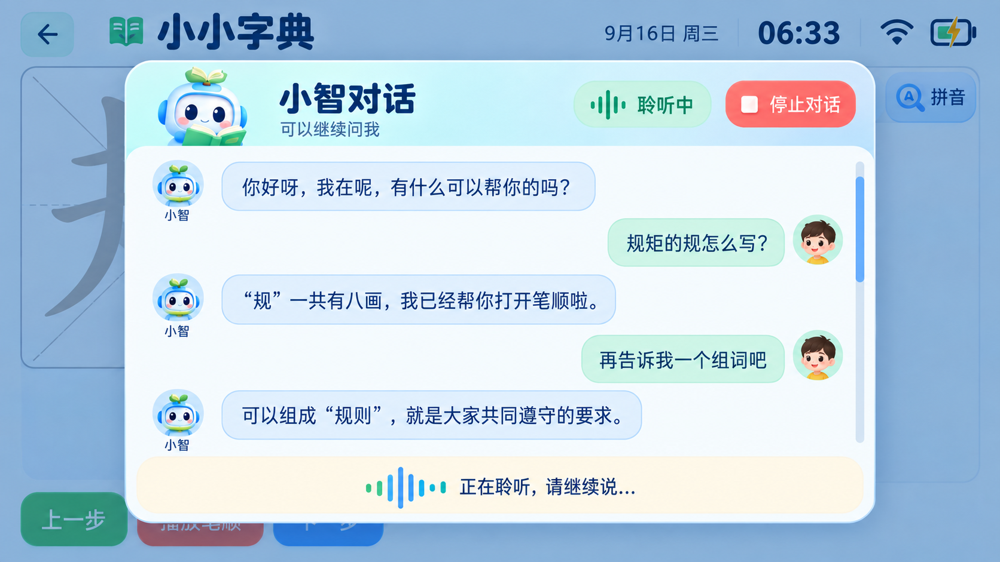

# 小智对话界面

## 视觉方向

概念稿由 ImageGen 根据真机截图和现有天气、字典、设置页面的视觉语言生成，作为布局与配色参考。固件界面仍使用 LVGL 原生控件、现有字体和已有小智图形资源实现，不把整张效果图作为页面背景。

## 已实现交互

- 功能页面唤醒小智后显示大尺寸对话卡片，当前学习页面以半透明遮罩保留在后方。
- 用户消息靠右并使用薄荷绿色气泡，小智消息靠左并使用浅蓝色气泡。
- 消息区可以上下滑动，右侧滚动条会在内容超出区域后出现，并自动定位到最新消息。
- 顶部状态胶囊区分连接、聆听和回答状态，底部固定显示当前语音阶段。
- “停止对话”按钮会根据当前状态结束聆听、打断回答或取消连接，不会在待机状态误启动新对话。
- 最近 14 条消息保留在本次开机期间；连续到达的小智语音句子会合并到同一个回答气泡。

## 资源与隐私边界

- 单条消息最多保留 768 字节，连续回答合并后最多 1024 字节，避免无限占用 ESP32 内存。
- 历史记录暂不写入 NVS 或 microSD，重启后清空；这样不会增加闪存写入，也避免默认长期保存儿童对话。
- 若后续需要跨重启记录，应增加家长开关、清除入口、容量上限和隐私说明，再接入 microSD 持久化。
