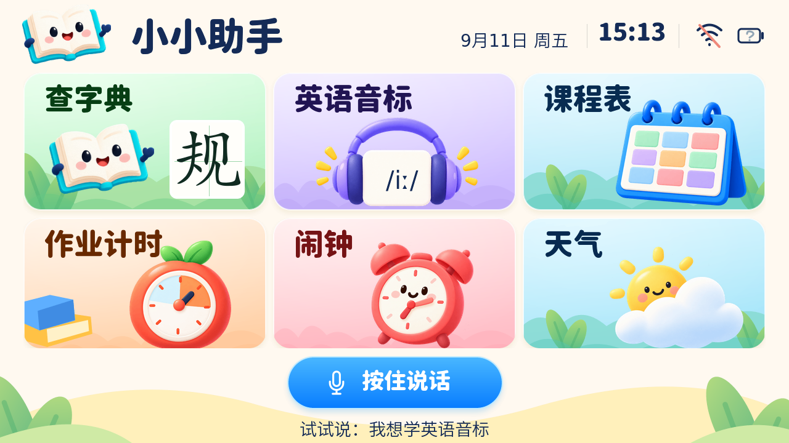

# UI3：参考图落到真正的 LVGL 主页

2026-09-11。以用户给出的“小小助手”六卡主页为参照，这次修改的是实际
`HanDisplay`，不是只制作一张静态效果图。[本次对照的用户参考图](reference-home-ui3.png)。



这是同一套 C++ 页面代码在本机 LVGL 模拟器中的渲染，**不是物理 Tab5 的照片**。
时间来自宿主机；这张图使用未联网、未知电量状态。
[联网/满电状态测试图](rendered-ui3/home-online-fixture.png) 使用明确的测试桩数据，
不是本机测得的设备状态。

## 字体

采用作者发布的 [Resource Han Rounded CN Heavy v0.990（资源圆体 Heavy）](https://github.com/CyanoHao/Resource-Han-Rounded/releases/tag/v0.990)，
对照后选定圆角、粗笔画和较饱满的字面，替换原来主页细字重的思源黑体。
[字体前后对照](rendered-ui3/font-comparison.png)。

AI 概念图没有可还原的字体元数据，因此这是视觉匹配后的真实字体，不能声称
已识别出生成图片使用的“原字体”。标题仍然是 LVGL 文本，不是从截图抠字。

| 位置 | 实际字体/大小 |
| --- | --- |
| 小小助手、页面标题 | 资源圆体 Heavy，62 px |
| 六入口标题 | 资源圆体 Heavy，48 px |
| 按住说话/松开发送 | 资源圆体 Heavy，36 px |
| 右上角时间 | 资源圆体 Heavy，40 px |
| 日期、提示、字典正文 | 原有思源黑体/DejaVu 字体 |
| 耳机卡片 `/iː/` | 现有 IPA 字体，使用真正的长度符号 U+02D0 |

全量 TTF 仅保存在 Git 的 `assets/source/fonts/`，固件嵌入四个压缩 4 bpp 子集。
字体为 SIL OFL 1.1；版权、许可证、来源和 SHA-256 随仓库及烧录包保存。
装饰标题字不代替教学字形；主页“规”字沿用有来源和许可的笔画路径。

## 页面与交互

- 顶部：书本吉祥物、粗圆标题，月/日/星期、独立时钟、分隔线、Wi-Fi、电池图标。
- 卡片：沿用六入口导航；标题在左上、插画在下方；增加云朵/叶子/书本多层装饰、
  圆角高光、细边线和柔和阴影。卡片内图片、文字、田字格不会吞掉触摸点击。
- 底部：奶油波浪与叶子、蓝色渐变圆角麦克风按钮、居中提示语。
- 内页保留返回按钮和原有内容，语音按钮调整高度避开原来的功能按钮。

日期和时钟使用系统本地时间；尚未同步时显示“日期待同步”和破折号。
Wi-Fi 根据实际连接状态/RSSI 显示关闭或 1/2/3 档，点击进入现有联网页面。
时间展示没有额外添加时区配置；设备端本地时间仍取决于现有系统同步/时区设置。

电量通过 `Board::GetBatteryLevel` 读取。**当前 Tab5 类未覆写该接口**，
因此当前硬件路径返回未知；本轮没有臆造 PMIC/I²C 引脚或未核验的电量寄存器。
未知、空、低、半、满、充电图标和映射已接入，尚待真实电量驱动。

## 按住说话不是点击切换

底部按钮独立使用 LVGL 按下/松开事件；没有绑定原来的点击切换动作。

1. 已联网且空闲/播报状态，按下后通过应用主线程调用 `StartListening`。
2. 松开、触点丢失、页面切换均请求结束；重复松开无副作用。
3. 若松开时还在连接，取消连接状态，防止松手后才进入持续收音。
4. 若很快松手、开始任务还没执行，排队的开始操作直接跳过。
5. 断网、配网状态、忙碌或本地音标播放期间不会启动该手动会话；连续按住最多 60 秒。

语音本身仍走小智已有联网协议和录音链路，不是新增离线中文识别。
内页原有“语音查字”等按钮仍使用点击切换模式，本轮新行为只对应底部按住按钮。
状态机、音频开始/结束的调用通过公开接口进行，没有修改共用协议实现。
模拟器验证事件和状态调用；真正的麦克风采集、服务端接收、网络竞态及触摸手感需要真机。

## 容量与性能边界

本轮把精选并按显示尺寸优化后的主页素材编进固件，因此**无 SD 卡也能显示这个主页**。
没有编入上一轮整个 252 PNG 图形包：新主页 PNG 载荷为 **170,713 字节，约 167 KiB**。
保留原始图和独立生成脚本，设备图片经过调色板优化，源文件不被覆盖。

Legacy：应用 **4,543,504 字节**，5 MiB 分区剩 **699,376 字节（13.3%）**。
P4X：应用 **4,567,184 字节**，剩 **675,696 字节（12.9%）**。
资源分区仍为 2,985,897 字节，剩 3,174,487 字节。分区布局未修改。

全部新增图片若同时解码为 RGBA，名义像素空间约 **3.72 MiB**，不是设备实测空闲内存。
当前没有为了效果图强制增大全局 LVGL 图片缓存；压缩 PNG 解码/刷新延时、
PSRAM 分配和实际帧率仍待测，不能把电脑渲染速度等同于 ESP32 的速度。

## 在另一台电脑继续

正常编译直接用 Git 中的 C 字体和图片数据，不要求安装系统字体或配置 AI 密钥。
重新生成时，在仓库根目录执行：

```powershell
npm ci --prefix tools/ui-assets
node tools/ui-assets/home-skin.cjs
node tools/ui-assets/generate.cjs
node --test tools/ui-assets/home-skin.test.cjs tools/ui-assets/graphics.test.cjs tools/ui-assets/resources.test.cjs
.\tools\preview-ui.ps1 -OutputPath docs/ui/rendered-ui3
```

改主页标题文字时，要同时更新 `home-skin.cjs` 中对应字体子集字符列表。
若只改正文，仍由 `generate.cjs` 从 C++ 和示例字条中收集字符。
可选运行 `node tools/ui-assets/font-compare.cjs` 重新生成字体对照。

## 验证

- 75 项 Python 回归通过，8 项 Node 资源/字体/体积测试通过。
- 原生 LVGL 页面渲染、六入口/返回、音标分页、计时、笔顺、查字回归通过。
- 新增按下/松开、重复松开、触点丢失、连接取消、排队快点、页面切换、60 秒保护测试。
- 实际模拟触点点击田字格，确认插画不遮挡主页入口。
- Wi-Fi 强/弱/离线，以及电池已知/低电/充电/未知映射通过测试。
- Legacy / P4X 产品固件均编译并通过 512 KiB 应用剩余容量门槛；其他板卡路径仍不包含新皮肤。

本机烧录包为 `dist/firmware/ui3-Legacy` 和 `dist/firmware/ui3-P4X`，旧 UI2 包不覆盖；
构建仍有原板卡代码的未使用变量和旧 I²C API 警告，本轮没有扩大范围改动它们。
真机到货后优先测试上电、触摸边缘、
方向、主页切换、按住语音、联网断开/重连、内存与电池读数来源。
