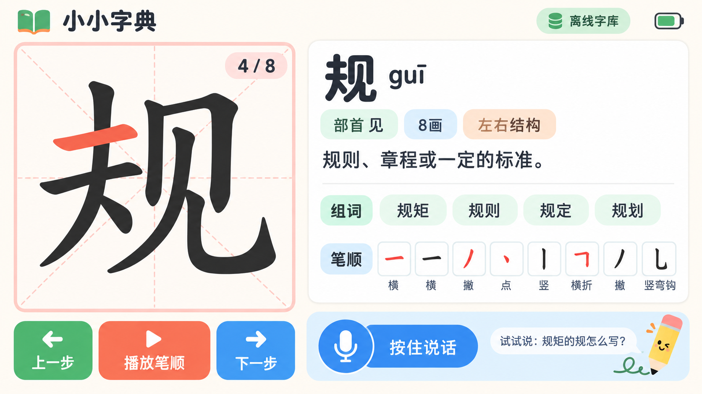

# Tab5 查字主界面

这张图是第一版可落地 UI 基准，目标分辨率为 1280×720，使用 LVGL 实现。

## 布局

- 顶栏高 72 px：产品名、离线字库状态、电池状态。
- 左侧约 43%：田字格、当前汉字、当前笔画高亮和 `4 / 8` 进度。
- 左侧底部：上一步、播放/暂停、下一步，最小触控高度 88 px。
- 右侧上部：汉字、拼音、部首、笔画数、结构和儿童化释义。
- 右侧中部：组词标签和完整笔顺。
- 右侧底部：主语音按钮与一句可模仿的提问示例。

## 视觉令牌

| 用途 | 色值 |
| --- | --- |
| 页面背景 | `#FFF9F0` |
| 主文字 | `#202938` |
| 薄荷绿 | `#52C986` |
| 天蓝 | `#338EF0` |
| 珊瑚橙 | `#FF694F` |
| 田字格线 | `#F6BBB4` |
| 卡片背景 | `#FFFFFF` |

圆角建议为 24 px；页面外边距 24 px；正文不小于 28 px。正式实现时汉字与笔画由字典数据动态绘制，不能把设计图中的字形烘焙进界面。

## 交互状态

1. 待机：显示大号麦克风和提问示例。
2. 聆听：麦克风按钮脉动，顶部显示“正在听”。
3. 查找：保留上一次结果并显示轻量加载状态。
4. 结果：展示字义并可播放笔顺。
5. 未找到：保留用户原话，提供拼音键盘和重新说话入口。
