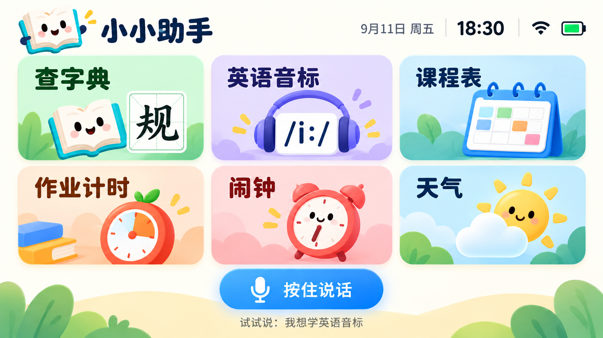
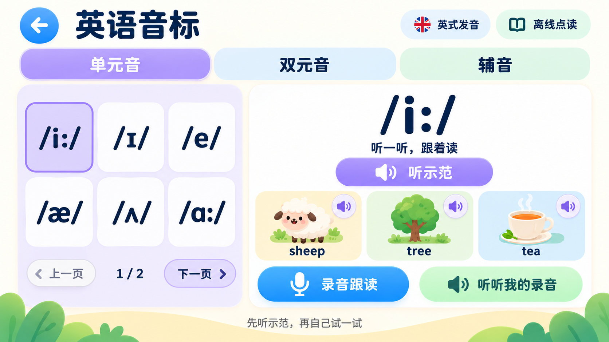
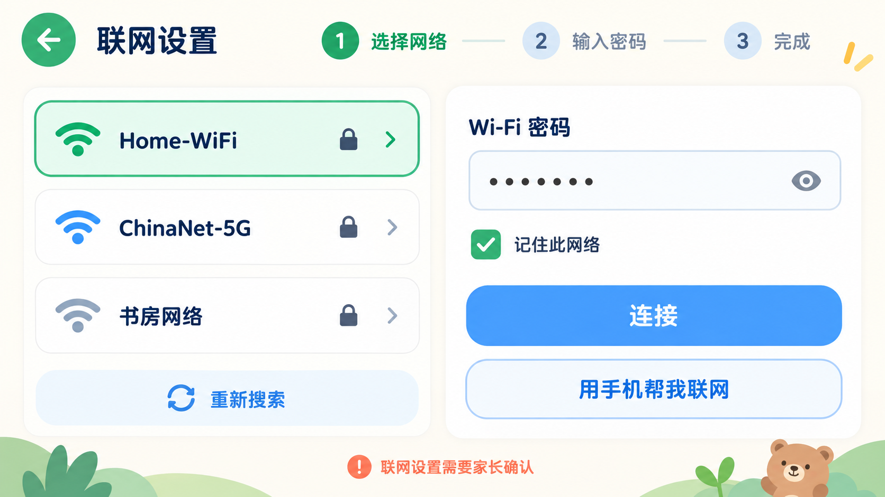
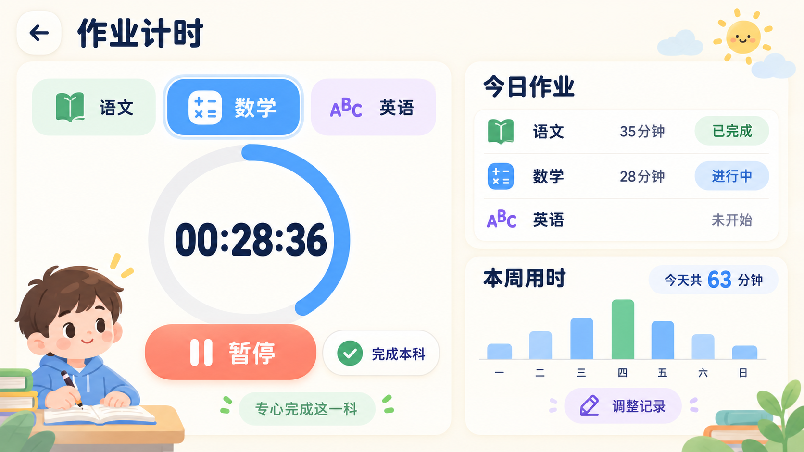
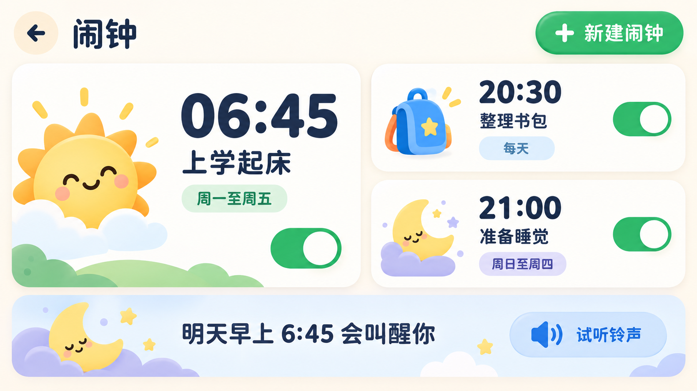
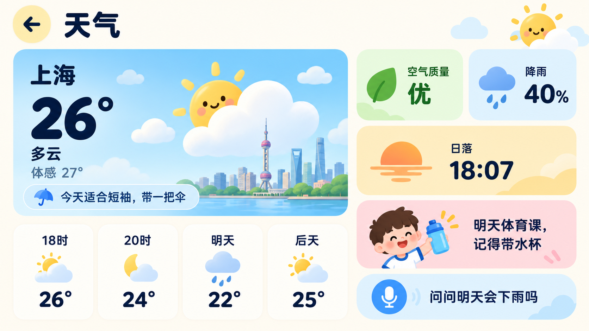

# Tab5 小小助手 UI 设计

目标设备为 M5Stack Tab5，横屏分辨率 1280×720。界面面向低龄儿童，原则是大字号、大触控区、低信息密度和稳定的返回路径；网络等配置项由家长操作。

> 这些图片是视觉与交互基准，不是固件截图。当前第一版固件仍使用小智原生界面，先验证启动、联网、语音链路和本地查字工具；后续再按本规范落地 LVGL 页面。

## 页面总览

| 页面 | 设计稿 | 核心任务 |
| --- | --- | --- |
| 主界面 v2 | [tab5-home-screen-v2.png](tab5-home-screen-v2.png) | 六个功能入口、时间状态、全局语音 |
| 查字典 | [tab5-dictionary-main-screen.png](tab5-dictionary-main-screen.png) | 字形、释义、组词和笔顺播放 |
| 英语音标 | [tab5-phonetics-screen.png](tab5-phonetics-screen.png) | 分类点读、示例单词、录音跟读与回放 |
| 联网设置 | [tab5-network-setup-screen.png](tab5-network-setup-screen.png) | 选 Wi-Fi、输入密码、家长确认 |
| 课程表 | [tab5-timetable-screen.png](tab5-timetable-screen.png) | 周课表、今日高亮、明日物品 |
| 作业计时 | [tab5-homework-timer-screen.png](tab5-homework-timer-screen.png) | 按科计时、完成状态、周统计 |
| 闹钟 | [tab5-alarm-screen.png](tab5-alarm-screen.png) | 起床、整理书包和睡眠提醒 |
| 天气 | [tab5-weather-screen.png](tab5-weather-screen.png) | 当前天气、短时预报、儿童提醒 |

## 导航与返回

- 主界面是导航根节点，不显示返回键。
- 所有二级页面左上角固定显示返回按钮，触控区域不小于 72×72 px。
- 从屏幕左边缘向右滑可作为辅助返回手势，但不能取代可见的返回按钮。
- 点击顶栏 Wi-Fi 图标进入联网设置；首次启动或断网且功能需要联网时，也可自动引导到联网设置。
- 作业计时返回后继续在后台计时；再次进入恢复当前科目与时长。完成本科时才停止并写入当天记录。
- 闹钟响铃页提供全屏“停止”和“稍后提醒”，不依赖实体键。
- Tab5 的 Reset/Boot/Power 键优先保留电源、下载模式和语音快捷键，不把它作为唯一返回键。固件可在非启动阶段把短按映射为语音开始/停止。

## 视觉令牌

| 用途 | 色值 |
| --- | --- |
| 页面背景 | `#FFF9F0` |
| 主文字 | `#142B57` |
| 薄荷绿 | `#43C47A` |
| 天蓝 | `#338EF0` |
| 珊瑚橙 | `#FF7866` |
| 淡紫 | `#A98BEF` |
| 卡片背景 | `#FFFFFF` |

圆角建议 24 px，页面外边距 24 px；正文不小于 28 px，主要按钮文字不小于 32 px。正常触控区不小于 56×56 px，返回和语音主按钮不小于 72×72 px。

## 主界面

- 采用两行三列的六张等尺寸卡片。第一行：查字典、英语音标、课程表；第二行：作业计时、闹钟、天气。
- 英语音标采用淡紫色、耳机与音标符号图标，与绿色查字典一起放在第一行。旧版五入口主界面保留为 `tab5-home-screen.png`，供对比使用。
- 顶栏只保留日期、时间、Wi-Fi 和电池，点击 Wi-Fi 状态进入联网设置。
- 底部“按住说话”是全局语音入口。语义路由示例：
  - “规矩的规怎么写” → 查字典并直接打开“规”。
  - “我想学英语音标” → 英语音标并恢复上次选中的学习卡片。
  - “明天上什么课” → 课程表并读出明日课程。
  - “开始写数学作业” → 作业计时并选中数学。
  - “明早六点四十五叫我” → 新建闹钟并等待确认。
  - “明天会下雨吗” → 天气并播报明日预报。

## 查字典

- 左侧为田字格和笔画播放；正式实现时字形与笔画必须由字典数据动态绘制，不能烘焙图片。
- 右侧显示拼音、部首、笔画数、结构、儿童化释义、组词和完整笔顺。
- 上一步、播放/暂停、下一步的最小触控高度为 88 px。

## 英语音标

- 左上角沿用统一返回按钮；返回主页后保留选中的分类、分页与音标。
- 页面分为单元音、双元音和辅音。音标区每页六张卡片，当前卡片高亮；分页数量由内容包决定。
- 右侧显示大音标、听示范按钮和三个例词。示例为 `/iː/`，例词为 sheep、tree、tea；例词分别可点读。
- 设计暂以英式发音为一个完整内容包，后续按教材选择口音。暂不固定“44/48 个”的总量，不混用不同体系的符号与录音。
- 第一阶段实现离线卡片、单音及例词播放；第二阶段增加录音跟读和回放。自动发音评分作为独立后续能力，不以通用语音识别成功与否判分。
- 录音流程为“开始录音 → 停止 → 回放”，回放与采集互斥；录音时暂停唤醒监听，离开页面停止录音，避免持续采集。未录音时回放按钮置灰。录音默认只保留本次会话，不上传。
- 设计图内的音标是生成式图像的视觉近似，不作为教材或字形素材。LVGL 实现必须使用支持 IPA 的字体子集，核对 `ɪ`、`æ`、`ʌ`、`ɑ` 和长度符号 `ː`（U+02D0）等字形，不能用冒号或英文字母替代。
- 内容结构建议包含稳定 ID、分类、口音、IPA 文本、示范音路径和例词列表。音频放入 microSD 内容包或经容量检查后的资产分区；按需读取，避免全部解码进内存。
- 示范音应使用可分发且经过人工核对的素材；不依赖通用 TTS 直接朗读音标字符串。资料参考：[British Council Sounds Right](https://learnenglish.britishcouncil.org/apps/learnenglish-sounds-right)，仅借鉴点音标听发音与例词的交互，不随设计稿复制其音频。
- 验收重点：六个主页入口可达、统一返回、离线播放、缺失音频提示、IPA 字形、录音与播放互斥、小智语音打断，以及孩子手指操作时的触控尺寸。

## 联网设置

- 使用“选择网络 → 输入密码 → 完成”的三步流程，不暴露 IP、DNS 等高级字段。
- 密码输入和连接确认属于家长操作；后续可增加手机配网，但第一版先做触屏键盘输入。
- 联网失败时保留密码，给出“重新连接”和“换一个网络”，避免让孩子理解错误码。

## 课程表

- 仅显示周一到周五和五个主要节次，当前日期所在列高亮。
- “明天要带”由家长配置，允许勾选物品；语音查询只读数据，不直接修改。

## 作业计时

- 每科有独立计时记录；同一时间只能有一个科目处于“进行中”。
- 暂停不记入专注时长，完成本科后写入当天汇总。
- 周统计只呈现趋势，不对孩子做速度排名；家长可在“调整记录”中修正误操作。

## 闹钟

- 第一版支持时间、名称、重复周期和启用开关。
- RTC 负责断网提醒；天气播报等联网内容不能阻塞基础铃声。

## 天气

- 重点是孩子能行动的信息，如衣着、雨伞、水杯，而不是复杂气象图表。
- 无网络时展示最后更新时间和上次缓存，不能把缓存天气伪装成实时数据。

## 实现顺序

1. 保持当前小智原生 UI，先在真机跑通启动、屏幕、触摸、联网、麦克风、扬声器和“规”查询。
2. 建立统一的 LVGL 页面容器、顶栏、返回导航和主题令牌，落地主界面、联网设置和查字典页。
3. 增加本地数据层与音标内容包：英语音标点读、课程表、分科计时、闹钟与天气缓存；随后接入录音回放。
4. 把小智语义路由映射到六个本地功能，再完善家长设置和异常状态。

生成这些视觉稿所用的最终提示词记录在 [PROMPTS.md](PROMPTS.md)。
