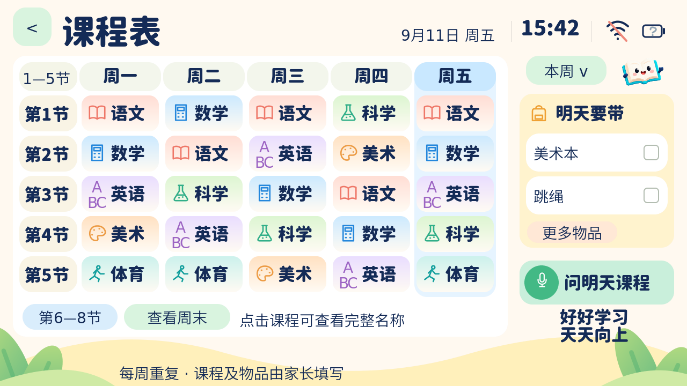

# UI4：课程表实际实现

2026-09-11。本页截图由 Windows 模拟器运行固件同一份 C++ / LVGL 代码生成，不是新的概念图。



截图使用 [演示课表](../examples/timetable.example.json)，不是孩子的真实课程。
正式 SD 模板仍为五个空数组；无卡、坏文件和空课表均有明确提示。

## 已实现

- 1280×720 横屏；复用 UI3 背景、吉祥物、日期、时间、Wi-Fi / 未知电池状态。
- 资源圆体 Heavy：标题、星期、节次、常见科目、物品面板标题和语音入口。
- 真实可点击表格：五个工作日，另有周末视图；1—5 / 6—8 节翻页，长课程名点击查看。
- 语数英科学美术体育有不同颜色和小图标；其他课程显示中性卡片。
- 本周高亮今天；“本周 / 下周”切换重复周模板，不是两套独立课表，不处理节假日调休。
- 右栏按设备当前日期读取**明天**物品（不会随“下周”模板切换）；两项一页，最多八项。
- 点击物品勾选，切页保留；重启、重新载入课表或日期变化后重置。暂不写 SD / NVS。
- 语音按钮开启现有小智对话，断网时提示联网。只读 MCP `self.study.timetable` 支持查询今天至七天后。
- MCP 返回真实课程、物品、日期、空模板标记；时间未同步或文件无效时明确报不可用。

课程查询在板级启动、SD 挂载后读取一次并缓存；MCP 回调只读内存，不在对话主循环中读卡。
UI 的初始读卡则在既有内容工作线程进行。当前两者都需要重启才能加载修改后的 SD 文件。

语义理解及语音回答仍需联网，尚未做真实设备 / 云端端到端验证。按钮不会在没有说话时
假装已经发起了“明天课程”文本提问；进入对话后可说“明天有哪些课，要带什么？”
电池图标显示未知不是满电，沿用 UI3 的真实能力检测。

## SD 结构

`SD:/handict/timetable.json`，UTF-8，无 BOM，文件上限 8192 字节。

```json
{
  "days": [["语文", "数学"], [], [], [], [], [], []],
  "supplies": [["美术本", "水杯"], [], [], [], [], [], []]
}
```

`days` 必填，`supplies` 可选；每项是周一开始的五个或七个数组，五天版本缺少的周末为空。
每个数组最多八个字符串，每个字符串最多 32 UTF-8 字节，不允许 NUL / 换行 / 制表符。
课程中的空字符串保留节次位置。`supplies[0]` 指周一当天需带的物品，不是周一提醒周二的物品。
空白表示没有填写，不能据此承诺“当天一定不上课”。周末和假期同理。

家长编辑 SD 内容包后运行 `python tools/content_pack.py validate <handict目录>`。
当前在开机时加载，修改卡后关机重新插卡启动；无热插拔和触屏编辑器。

新课程 / 物品的中文可能超出现有精简字库。需要把正式课表也放进仓库
`content/sdcard/handict/timetable.json` 后运行 `node tools/ui-assets/generate.cjs` 并重新编译。
该生成器只从课表收集字形，不会把课表数据作为默认课程写入固件；正式课程仍从 SD 读取。
任意中文动态 SD 字体尚未接入。

## 资源与复现

六个 40×40 PNG 合计 **4,226 字节**，来自既有原创矢量图标系统；背景和吉祥物复用已有资源。
32 px 粗圆体为 4 bpp 无损压缩子集，许可沿用 SIL OFL。没有把整张设计图烘焙进固件。

```powershell
npm ci --prefix tools/ui-assets
node tools/ui-assets/timetable-assets.cjs
node tools/ui-assets/generate.cjs
./tools/preview-ui.ps1 -OutputPath docs/ui/rendered-ui4
python -m unittest discover -s scripts/tests -v
node --test tools/ui-assets/*.test.cjs
```

模拟器验证空白 / 非法 / 演示数据、节次翻页、周末、本周下周、物品勾选和分页、离线语音保护，
并继续验证主页、导航、IPA、笔顺和计时。Windows 模拟器使用音频 / 网络桩，不能证明真实录音和 Wi-Fi 正常。

硬件到货后：确认 Legacy / P4X 修订 → 刷对应包 → 无卡启动 → 正式课表卡加载 → 校时及跨日
→ 实际触屏 → 联网询问课程 → 运行内存和交互流畅度。容量分析见 [固件体积说明](../FIRMWARE_SIZE.md)。

本轮最终两种板型均编译和打包通过：

| 板型 | 应用字节 | 5 MiB 槽余量 | 本机最终烧录包 |
| --- | ---: | ---: | --- |
| Legacy | 4,594,448 | 648,432（12.4%） | `dist/firmware/ui4-final-Legacy` |
| P4X | 4,618,240 | 624,640（11.9%） | `dist/firmware/ui4-final-P4X` |

旧包与本轮中间包均保留；刷机请选择以上 `ui4-final-*`，不要混用硬件修订。
烧录包属于本机构建输出，不进 Git；另一台电脑拉取代码后按常规 `tools/setup.ps1` / `tools/build.ps1`
重新生成。已生成的字体和图标 C 文件进 Git，普通固件构建无需重新安装图形生成工具。
